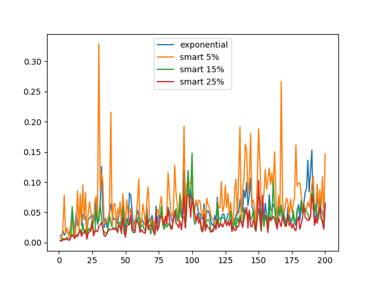

This is an implementation of various quantization schemes to minimize variance. 
The code implements a range of different quantizers, and allows to integrate them into a harness which can train a specific set of models using quantized gradients.

In each iteration of the SGD it takes the gradient, applies a quantization to it and only after applies the gradient to the model.
By that it emulates the quantization process.

The quantization is specified by the `bucket` size and the quantization `level`. The quantization
splits the gradient into buckets and applies to bucket the chosen quantization algorithm that quantizes to `level` different values.

There are four different quantization algorithms available:
1. None
2. Standard. Take min and max in the bucket. Take the `level` target points uniformly at random from min-max range.
Then each value from the bucket is assigned to the nearest target point.
3. Variance reduction. Choose max(`P%1`, 512) candidates from the bucket and then find `level` target points that
reduce the variance (see https://arxiv.org/abs/1611.05402 for more details). Then each value from
the bucket is assigned to the nearest target point.
`P=1%` is chosen to amortize the complexity of the target point algorithms which is `O(n level log n)` where n is the number
of points to choose from.
4. Hadamard. Almost as the standard one. Apply Hadamard-Walsh transfrom to bucket and use the standard quantize way from 2.
5. Exponential. Calculate the norm of the gradient `norm`. For each element of the gradient we divide its absolute value by `norm` and
round it to the nearest power of two. Note that the different number of powers of two is `level/2` since
we spend one bit to store the sign of each element of the gradient.

By default `bucket` is of size 512 and `level` is 16.

Usages with different quantization algorithms:

`cifar.py --model resnet_20 --optimizer quantization --quantization-type none`

`cifar.py --model resnet_20 --optimizer quantization --quantization-type standard`

`cifar.py --model resnet_20 --optimizer quantization --quantization-type smart --bucket-size 51200`

`cifar.py --model resnet_20 --optimizer quantization --quantization-type hadamard`

`cifar.py --model resnet_20 --optimizer quantization --quantization-type exponential`

The following table contains some information concerning running resnet-20 cifar-10 on the convnet regime, i.e., 200 epochs
with decaying learning rate, using three quantization algorithms: standard, smart and exponential, with `bucket` size `51200` and `level` 16 both.

|               |standard | exponential| smart 1% | smart 5% | smart 15% | smart 25% |
|---------------|---------|------------|----------|----------|-----------|-----------|
|test accuracy  |  90.8%  | 92.2%      |91.4%     |    ~     |    ~      |    ~      |
|time per epoch | ~130s   | ~330s      | ~350s    |  ~1225s  |    ~      |    ~      |
|avg. variance  | 1.044   |  0.049     |  0.18    |  0.069   |   0.036   |   0.03    |

Variance of the quantization is considered as follows. We find `level` target points. Then for any `x` from the bucket
we choose the two nearest target points `l` and `r` from below and above, and finally add `(x - l)(r - x)` to the variance.

To calculate the average variance we run standard SGD for the first 200 steps,
get the gradient, calculate its quantization variance and update model with
the original gradient.

Here you can see the plots of the variance of the quantization for the first 200 gradients.
.
